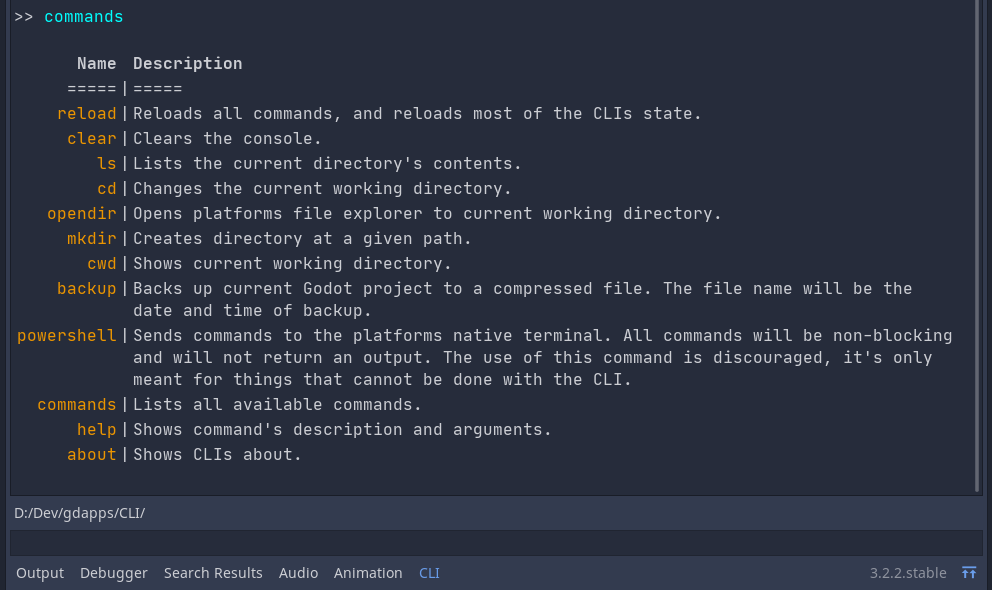
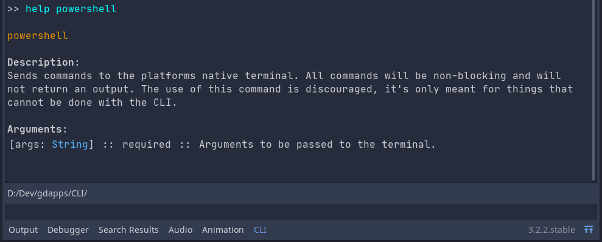

# Godot-CLI
In-editor command-line interface for the Godot Engine 3.2.2, with basic console features such as `ls`, `cd`, `mkdir`, etc.  
The CLI ccan be easily extended with gdscript by adding custom commands.  
The CLI is not meant to replace your native operating system's console,
but it allows users to create commands that will help with workflow and automation.

This project was built upon [quentincaffeino's Godot's Console](https://github.com/QuentinCaffeino/godot-console).   
It's thanks to all their hardwork that this project exists. Please check their project out.

## Features
- Command and directory autocompletion with the `tab` hotkey
- Command history by pressing the `up` or `down` hotkeys for the current session
- User prompts
- `alt + ~` hotkey to quickly open and close the CLI dock
- Allows for optional arguments

## Installation
1. Clone or download this repository into your project's addons folder: `res://addons/uphoric.CLI`
2. Enable the CLI in the projects/addons settings
3. Restart your Godot editor

See the [official documentation](https://docs.godotengine.org/en/stable/tutorials/plugins/editor/installing_plugins.html) for addons for more information.

## How to use
Type `commands` to list all available commands.
Type `help {command}` to get the commands description and arguments.

### Commands

### Help


## Adding commands
Add a `.gd` script under `res://addons/uphoric.CLI/load`  
The script should extend reference  
Register all commands in `func _init()` function

```gdscript
func _init() -> void:
    # add_command takes in the name of the command, and the function reference for the command
    # set_description takes in a string with the commands description
    # add_argument takes in the argument name, the argument type, the description and if its optional
	CLI.add_command('hello', funcref(self, 'hello'))\
	.set_description("Prints hello to CLI.")\
	.add_argument("name", TYPE_STRING, "Name to be printed.", true)


# if the command has optional argument make sure to give it a default value!
func hello(name: String = "") -> void:
    while(name.empty()):
        CLI.error("Please specify name!")
        CLI.newline()
       
        # the yield allows for user prompts
        name = yield(CLI.input(), "user_input")

    CLI.write("Hello " + name)
```

In the CLI run the `reload` command if the script was added while the editor is open.
